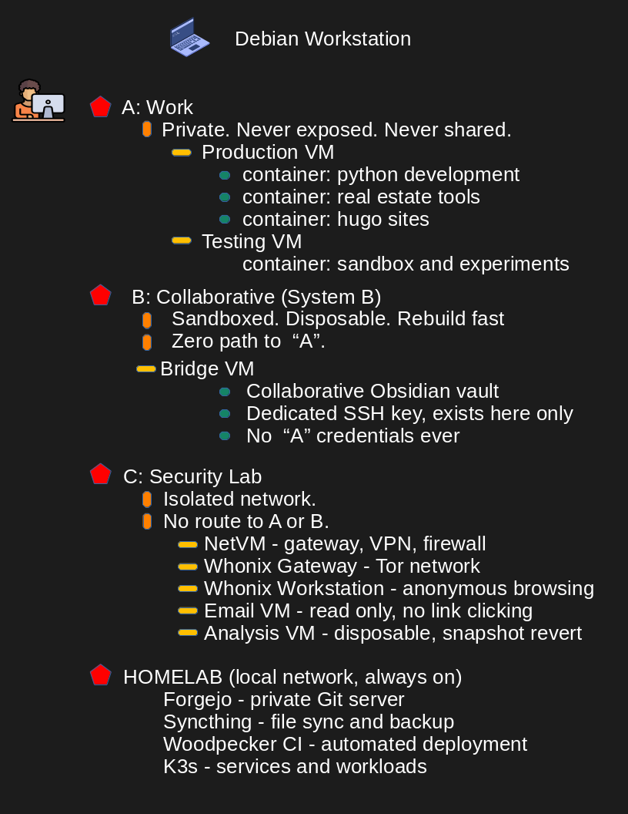

# RADENIX - Architecture

> Self-hosted infrastructure on bare-metal Debian based
> Isolation into different zones. Infrastructure as a code
> Offline-capable and fully rebuildable from scratch

## Philosophy

> Everything will run on Laptop, home-lab is a backup and services only. If the Laptop dies I will rebuild it with **Forgejo**, **Ansible** and **Chezmoi**.			
- *Forgejo* is self hosted lightweight software for managing and collaborating on software projects using Git control system. 
- *Ansible* is an open-source automation tool that simplifies IT tasks such as configuration managenmnet, aplication deployment and orchestration, it allows users to automate repetitive tasks.
- *Chezmoi* is a dotfile manager that helps in managing personal configuration files across multiple mmachines securely. Makes consistent handling differences between systems and managing secrets.

## Hardware

1: *Workstation* Debian 12 Laptop - bare metal main workstation    
2: *Home-Lab* Always local server - backup and services **(Network Level restictions)**   
3: *Second workstation* Debian Trixie build    
4: *Third workstation* High-Spec desktop workstation **Windows** based    


|| Building status ||
|---|---|---|
| Phase 1 | Laptop Structure | Complete |
| Phase 2 |  SSH and Machine Access | Complete |
| Phase 3 |  Bridge VM (System B) | In-Progress |
| Phase 3b |  Security Lab |  Planned |
| Phase 4 |  Windows Integration |  Planned |
| Phase 5 | Content Production |  Planned |
| Phase 6 |  Editor and Workspace |  Planned |
| Phase 7 |  Personal Obsidian |  Planned |
| Phase 8 | Visual Documentation | Planned |
| Phase 9 | Offline ability | Planned |
| Phase 10 | Homelab Foundation |  Planned |
| Phase 11 |  Automated Deployment | Planned |
| Phase 12 | Ansible Automation |  Planned |
| Phase 13 | Incus Profiles | Planned |
| Phase 14 | K3s on Homelab | Planned |


## Separation Architecture

Three completely isolated network, not separated by firewall rules, separated by routing, a compromised zone cannot reach another zone.		



<h3 align="center">DEBIAN: SYSTEM OVERVIEW</h3>


| Layer | Component | Description | Security Level |
|------|----------|------------|---------------|
| Host | Debian (Bare Metal) | Main OS - virtualization, containers and network control |  Highest |


<h3 align="center">A: Personal Work</h3>

| Type | Component | Description | Rules |
|------|----------|------------|------|
| VM | Production VM | Stable working environment | Never exposed and private only |
| C1 | Python Development | Scripts, automation, pipelines | No external access |
| C2 | Real Estate Tools | GIS, data processing tools | Local use only |
| C3 | Hugo Sites | Static site generation | Deploy only from controled environment |
| / | / | / | / |
| VM | Testing VM | Experimentation environment | No sensitive data |
| C1 | Sandbox + Experiments | Testing new tools/code | Disposable |


<h3 align="center">B: Collaborative (System B)</h3>

| Type | Component | Description | Rules |
|------|----------|------------|------|
| VM | Bridge VM | Controlled collaboration layer | Rebuildable fast |
| Service | Obsidian Vault | Shared notes/workspace | No sensitive data |
| Security | Dedicated SSH Key | Used only inside this VM | Never reused elsewhere |
| Policy | Isolation Rule | No access to "A" | Strict separation |


<h3 align="center">C: Security Lab<h3>

| Type | Component | Description | Rules |
|------|----------|------------|------|
| VM | NetVM | Gateway, firewall, VPN routing | All traffic passes through |
| VM | Whonix Gateway | Tor routing layer | Anonymous traffic |
| VM | Whonix Workstation | Tor-based browsing | No identity usage |
| VM | Email VM | Email access (read-only) | No clicking links |
| VM | Analysis VM | Suspicious link/file analysis | Snapshot + revert |
| VM | Pentest VM | Security testing environment | Local home-lab testing only |
| Policy | Network Isolation | No route to "A" or "B" | Full isolation |


<h3 align="center">HOMELAB: Local Network (Always On)<h3>

| Type | Component | Description | Purpose |
|------|----------|------------|--------|
| Service | Forgejo | Private Git server | Code hosting |
| Service | Syncthing | File sync & backup | Data redundancy |
| Service | Woodpecker CI | CI/CD automation | Deployment pipeline |
| Service | K3s | Lightweight Kubernetes | Service orchestration |


<h3 align="center">SECURITY MODEL SUMMARY<h3>

| Principle | Description |
|----------|------------|
| Isolation | Each zone separated by network and purpose |
| Least Privilege | No unnecessary access between zones |
| Disposable Systems | "B" and "C" can be rebuilt fast |
| No Credential Leakage | Credentials never cross |
| Controlled Networking | All risky traffic routed |


| # | Network Isolation | # |
|---|---|---|
| network-a |    10.10.1.0/24 |   Production work |
| network-b |   10.10.2.0/24 |   Bridge VM only |
| network-c |   10.10.3.0/24 |   Security lab |
| homelab-network |  192.168.x.0/24 |  Local network |


## Directory Structure 

***~/lab/***   

- Single root directory. 
- Everything version controlled.
- Infrastructure, dotfiles, work.


<h3 align="center">Infrastructure (`infra/`)<h3>
<p align="center">*Private Git repo (Forgejo)*</p>

| Path | Description |
|------|------------|
| infra/ansible/playbooks/bare-metal.yml | Base system setup (host machine) |
| infra/ansible/playbooks/production-vm.yml | Production VM |
| infra/ansible/playbooks/testing-vm.yml | Testing VM  |
| infra/ansible/playbooks/containers/ | Container-specific playbooks |
| infra/ansible/inventory/group_vars/ | Environment variables & configs |
| infra/ansible/roles/base/ | Base system configuration role |
| infra/ansible/roles/python-dev/ | Python development setup |
| infra/ansible/roles/neovim/ | Neovim configuration |
| infra/incus/profiles/ | Container profiles |
| infra/incus/images/ | Base container images |
| infra/ssh/start-container.sh | Script to start containers |
| infra/ssh/config.template | SSH config template |


<h3 align=center>Dotfiles (`dotfiles/`)<h3>

<p align="center">*Private Git repo (Forgejo)*</p>

| Path | Description |
|------|------------|
| dotfiles/nvim/ | Neovim configuration |
| dotfiles/tmux/ | Tmux configuration |
| dotfiles/shell/ | Shell configs (bash/zsh) |
| dotfiles/git/ | Git configuration |
| dotfiles/tools/ | CLI tools setup |


<h3 align="center">Work (`work/`)</h3>

<p align="center">*Multiple Git repos*</p>


<h3 align="center">vm-storage<h3>

| Path | Description |
|---|---|
| vm-storage/disks/    | VM qcow2 disk images |
| vm-storage/snapshots/  | VM snapshots |
| vm-storage/backups/    | VM backups to homelab |


<h3 align="center">Python</h3>

| Path | Description |
|------|------------|
| work/python/learning/year-1/ | Structured learning path |
| work/python/learning/exercises/ | Practice exercises |
| work/python/real-estate/visualizations/ | Data visualizations |
| work/python/real-estate/automation/ | Automation scripts |
| work/python/experiments/ | Random experiments |

<h3 align="center">Sites</h3>

| Path | Description |
|------|------------|
| work/sites/business/ | Client-facing website |
| work/sites/docs/ | Documentation site |
| work/sites/learn/ | Learning content |
| work/sites/opensource/ | Open source projects |

<h3 align="center">Scripts</h3>

| Path | Description |
|------|------------|
| work/scripts/video/ | Video automation tools |
| work/scripts/utils/ | General utilities |
| work/scripts/realestate/ | Real estate tools |

<h3 align="center">Creative</h3>

| Path | Description |
|------|------------|
| work/creative/ | Design, 3D, experiments |


<h3 align="center">Notes (`notes/`)</h3>

<p align="center">*Private Git repo (Forgejo)*</h3>

| Path | Description |
|------|------------|
| notes/daily/ | Daily notes |
| notes/python/ | Python knowledge |
| notes/linux/ | Linux notes |
| notes/infra/ | Infrastructure notes |
| notes/ideas/ | Ideas & concepts |
| notes/imported/ | External content |
| notes/diagrams/excalidraw/ | Excalidraw diagrams |
| notes/diagrams/drawio/ | Draw.io diagrams |
| notes/diagrams/generated/ | Auto-generated diagrams |


<h2 align="center">Resources (`resources/`)</h2>

| Path | Description |
|------|------------|
| resources/books/ | Books (PDFs, notes) |
| resources/python/ | Python references |
| resources/linux/ | Linux references |
| resources/devops/ | DevOps materials |
| resources/math/ | Math resources |
| resources/business/ | Business materials |


<h2 align="center">STRUCTURE SUMMARY</h2>

| Area | Purpose |
|------|--------|
| infra | System automation & provisioning |
| dotfiles | Personal environment config |
| vm-storage | Dedicated directory for VM storage |
| work | Active projects & development |
| notes | Knowledge base |
| resources | Learning materials |

<h3 align="center">SSH Auto-Start System</h3>

Bare metal reaches any VM or container with one command. VMs and containers start automatically on connection if stopped.   


```bash
ssh production-vm     # starts VM if stopped and connects
ssh container-python  # 13 May 2026 - containers are not still setup to work with this system
```

---

Script: ~/lab/infra/ssh/start-container.sh takes 8 arguments:   

---

```bash
$1  VM_NAME          libvirt VM name
$2  CONTAINER_NAME   Incus container name (or "none")
$3  VM_SSH_USER      username on VM
$4  VM_SSH_PORT      VM SSH port
$5  VM_IP            VM IP address
$6  VM_SSH_KEY       path to SSH key for VM
$7  CONTAINER_IP     container IP address
$8  CONTAINER_PORT   container SSH port
```

1. Check VM state with virsh domstate   
2. Start VM if not running with virsh start   
3. Wait for SSH port with nc loop (max 30 attempts)   


***For containers inside VMs this script is not yet setup.***  


|#| Virtualization |#|
|---|---|---|
| Hypervisor |    KVM/QEMU via libvirt |
| VM management |  virsh (Terminal) |
| GUI (optional) | virt-manager |
| Containers |     Incus (inside VMs) |
| Networking |     libvirt networks, isolated |

VM user access to libvirt (no sudo needed):			
```bash
# User added to libvirt group
usermod -aG libvirt username
```

### Rebuild Procedure

If laptop is destroyed or replaced:

1. Fresh Debian install
2. Install: git, ansible, chezmoi
3. Clone ~/lab/infra from Forgejo
4. Run: ansible-playbook playbooks/bare-metal.yml
5. Run: chezmoi apply
6. Clone remaining ~/lab repos from Forgejo
7. Restore SSH keys from encrypted homelab backup
8. Import VM snapshots from homelab storage
9. Start Syncthing — notes sync automatically


### Offline Capability (13 May 2026 - Still not done )

Full working day possible without internet and without homelab access.

```bash
Python packages:  devpi-server on bare metal
                  pip points to local cache
                  packages install offline

Debian packages:  apt-cacher-ng on bare metal
                  all VMs point to local cache
                  apt install works offline

Git repos:        local mirrors of all repos
                  push/pull locally when offline
                  sync to Forgejo on reconnect

Documentation:    Hugo serves sites at localhost
                  entire knowledge base readable
                  no internet required
```

<h3 align="center">Tools</h3>

Editor:         Nano + Neovim with lazy.nvim   
Terminal mux:   Tmux with tmux-resurrect   
Shell:          Bash **configured, aliased**   
Dotfiles:       Chezmoi **deploy anywhere**   
Version		Git **daily commits, real history**   
IaC:            Ansible   
Containers:     Incus **profiles, fast provisioning**   
K8s:            K3s on homelab **(in progress)**   
Sync:           Syncthing **peer-to-peer, no cloud**   
VPN:            WireGuard in NetVM   
Monitoring:     Prometheus + Grafana **(planned)**   
Cloud:		Oracle **free tier**   


<h2 align="center">Security</h2>

1. Zone separation is routing and not firewall rules
2. Bridge VM has zero credentials to "A"
3. Analysis VM reverts to clean snapshot before each use
4. SSH keys are specific, no key crosses zones
5. No clipboard sharing between zones
6. No shared folders between zones
7. Everything offline capable
8. Documenting before I forget  **(notes are infrastructure too)** 

***most documentation that I take is written in my own Language for reason of easier Learning and understanding it more***

Everything documented. Everything version controlled, building in public at [radenix.com](www.radenix.com)


